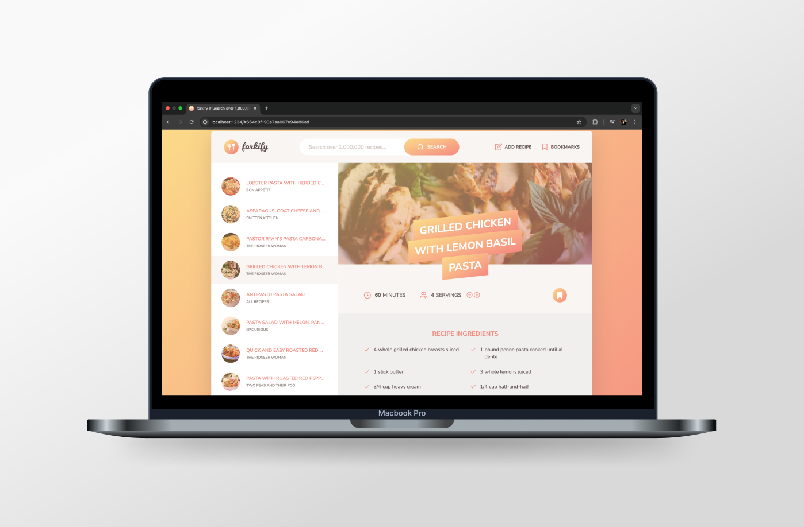

# [Forkify 🍽️](https://forkify-mihailomarkovic.netlify.app/)

## Introduction

Forkify is a modern JavaScript application for browsing, bookmarking, and managing recipes. This project is a culmination of my JavaScript knowledge, where I applied advanced concepts and best practices to create a dynamic, user-friendly web application. The app fetches recipes from an external API, allows users to search for meals, bookmark their favorites, and even add their own recipes, all while following the MVC (Model-View-Controller) architecture.

## Project Highlights

- **Built using JavaScript (ES6+)** with a structured and maintainable MVC architecture
- **Integrated API requests** to fetch and display real-time recipe data
- **Implemented event listeners in multiple ways** to handle user interactions
- **Designed a functional and user-friendly interface** with seamless navigation
- **Developed persistent local storage** to save bookmarks and user-added recipes
- **Created key features** such as search, pagination, and a recipe upload form

## What I Learned

This project was an incredible learning experience where I:

✅ Mastered **API integration** by fetching and rendering JSON data efficiently  
✅ Explored **different event-handling techniques** to improve user interactions  
✅ Designed and structured the project using the **MVC architecture** for scalability  
✅ Planned the project using **charts and structured workflows**  
✅ Developed a **search form, pagination system, and bookmarking functionality**  
✅ Built a **local storage system** to retain user data and preferences  
✅ Improved problem-solving skills by debugging and optimizing JavaScript code

## Project Features

- **Recipe Search**: Find recipes from a vast database using a keyword-based search
- **Pagination**: View search results efficiently with paginated pages
- **Bookmarks**: Save favorite recipes for quick access
- **Add Custom Recipes**: Users can submit their own recipes
- **Local Storage**: Recipes and bookmarks persist even after refreshing the page
- **Adjustable Servings**: Users can change the number of servings for a recipe, and ingredient amounts are recalculated automatically

## Technologies Used

- **JavaScript (ES6+)** – Core logic and functionality
- **HTML5 & CSS3** – Structuring and styling the UI
- **Forkify API** – Fetching real-time recipe data
- **Parcel** – Module bundling and project optimization
- **LocalStorage** – Persistent data storage

## Closing Thoughts

Forkify is the project I am most proud of. It allowed me to bring together all my JavaScript knowledge and apply best practices in real-world web development. I enjoyed building every part of this project and learned a ton of new things in the process. I look forward to applying these skills in future projects and professional environments.
